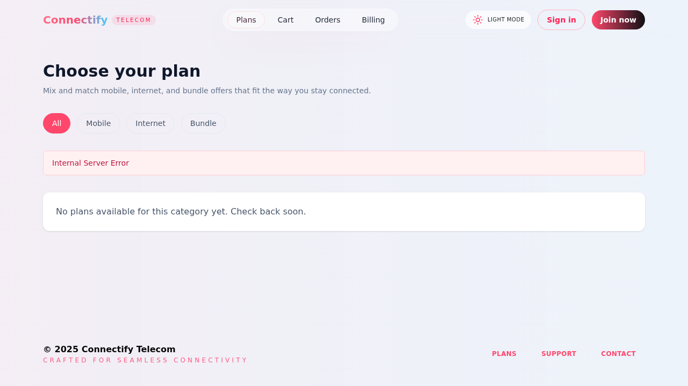
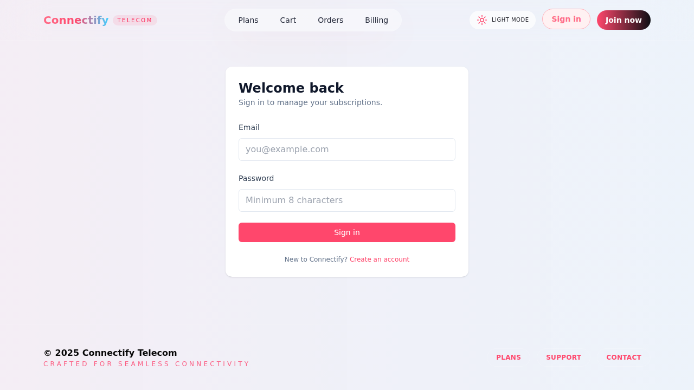
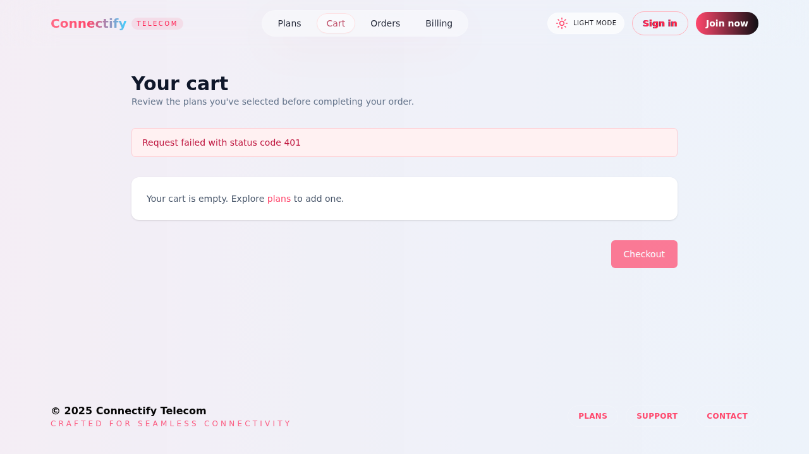

# Proximus-Inspired Telecom Experience

Modern full-stack telecom reference implementation inspired by Proximus styling (original assets only). The project combines a React/Next.js 14 UI with a Spring Boot microservice suite, edge gateway, in-memory persistence, Docker Compose orchestration, automated smoke flows, and Postman coverage.

> **Note:** All visuals, copy, and assets are custom-built for this demo. No Proximus trademarks or copyrighted materials are used.

- **UI:** Next.js 14, TypeScript, TailwindCSS, Zustand, React Hook Form, Zod, Axios  
- **Gateway:** Spring Cloud Gateway (JWT-aware)  
- **Services:** Java 17, Spring Boot 3 (auth, product, order, billing) with H2  
- **Auth:** JWT (HS256), BCrypt hashing, httpOnly cookie session  
- **Features:** Registration, login, product browsing, cart & checkout, invoice lifecycle, profile view  
- **Run modes:** Local dev (`npm run dev`, `mvn spring-boot:run`) or full stack via `docker compose up --build`  
- **Verification:** Bash smoke script & Postman collection, JUnit/Mockito tests, Playwright UI smoke

---

## Repository layout

```
.
|-- .env.example                # Template env vars (copy to .env and adjust)
|-- docker-compose.yml          # Full stack orchestration
|-- gateway/                    # Spring Cloud Gateway + JWT filter
|-- auth-service/               # Auth microservice (H2, BCrypt, JWT issuance)
|-- product-service/            # Product catalog + seeding
|-- order-service/              # Cart + order management
|-- billing-service/            # Invoice lifecycle
|-- ui/                         # Next.js 14 app router UI
|-- scripts/
|   |-- smoke.sh                # cURL-based E2E happy-path check
|   \-- seed-products.json      # Shared seed catalogue
\-- postman/
    \-- ProximusInspired.postman_collection.json
```

---

## Quick start

1. **Clone & configure**
   ```bash
   cp .env.example .env
   # edit .env if you need to override ports or secrets
   ```

2. **Local dev (split terminals)**
   ```bash
   # UI (Next.js)
   cd ui
   npm install
   npm run dev

   # Backend services (from repo root)
   mvn -q -pl auth-service,product-service,order-service,billing-service,gateway -am spring-boot:run
   ```
   Services are reachable at:
   - Gateway: `http://localhost:8080`
   - UI: `http://localhost:3000`

3. **Docker Compose (full stack, in-order startup)**
   ```bash
   docker compose up --build
   ```
   Only ports `8080` (gateway) and `3000` (UI) are exposed on the host. Containers share an internal `appnet` bridge network.

4. **Seed catalogue (optional, in dev mode auto-seeded)**
   ```bash
   curl -X POST http://localhost:8080/api/products/seed
   ```

5. **Smoke test (bash & curl required)**
   ```bash
   bash scripts/smoke.sh
   ```
   The script registers a throwaway user, logs in, adds a product to cart, checks out, creates and pays an invoice, then verifies orders & invoices endpoints.

---

## Service overview

| Service           | Port | Responsibilities                                                |
|-------------------|------|-----------------------------------------------------------------|
| `gateway`         | 8080 | JWT validation, header enrichment, routing to downstream APIs   |
| `auth-service`    | 8081 | Registration, login, profile lookup, JWT issuance, logout       |
| `product-service` | 8082 | Product catalogue CRUD (read-only endpoints exposed), seeding   |
| `order-service`   | 8083 | Cart management, checkout, order history                        |
| `billing-service` | 8084 | Invoice creation, mock payments, invoice history                |
| `ui`              | 3000 | Next.js app for all customer-facing flows                       |

- Auth tokens are issued by `auth-service` and propagated via the gateway.  
- Gateway injects `Authorization`, `X-User-Id`, and `X-User-Email` headers for downstream services.  
- Services validate JWTs independently (belt & braces).  
- All persistence uses in-memory H2 (dev-friendly).  
- DTO-based responses, consistent error shape `{timestamp, path, status, error, message}`.

---

## Environment & configuration

Key environment variables (see `.env.example`):

- `JWT_SECRET`: Base64-encoded HS256 secret used across gateway & services. **Change for real deployments.**
- `*_PORT`: Override individual service ports if needed.  
- `PRODUCT_SERVICE_URL`, `ORDER_SERVICE_URL`: Resolve to service hostnames. Defaults target Docker network hostnames; when running locally without Compose, set them to `http://localhost:<port>` for cross-service HTTP calls.
- UI uses `API_BASE` to direct API requests (defaults to `http://localhost:8080`). Docker Compose sets this to `http://gateway:8080` inside the container.

---

## Testing & quality gates

### JVM services
```bash
# From repo root
mvn -pl auth-service test
mvn -pl product-service test
mvn -pl order-service test
mvn -pl billing-service test
mvn -pl gateway test
```
Each service ships with 5+ focused tests covering core behaviours (auth hashing/token flow, product filtering/seed idempotency, cart math & order creation, invoice lifecycle, gateway filter logic).

### UI
```bash
cd ui
npm test # executes Playwright smoke (alias for `npm run test:e2e` if you prefer)
```
Playwright smoke ensures the home page renders key hero and plan tiles.

### Smoke script
See [Quick start](#quick-start) step 5.

### Postman
Import `postman/ProximusInspired.postman_collection.json` for a ready-to-run flow (register -> login -> cart -> checkout -> billing).

---

## Development notes

- All services enable the H2 console (`/h2-console`) in dev; ensure youre authenticated first (gateway enforces JWT).  
- Passwords are hashed with BCrypt (`BCryptPasswordEncoder`).  
- JWT cookies (`accessToken`) are httpOnly/sameSite=Lax. Logout clears the cookie.*  
- Product seeding reads from `classpath:seed-products.json`; dev profile seeds on startup if the table is empty.  
- `order-service` resolves product pricing via `product-service` before checkout to guarantee totals.  
- `billing-service` fetches order totals via `order-service` before issuing invoices.  
- Gateway denies protected routes without JWT (either from `Authorization` header or `accessToken` cookie). Public GET requests to `/api/products/**` remain open for browsing.

> *Because the cookie is httpOnly, the UI triggers the `/api/auth/logout` endpoint to clear it server-side.

---

## UI walkthrough (placeholders)

| Page         | Description                                      |
|--------------|--------------------------------------------------|
| `Home`       | Hero banner, featured plan tiles, bundle comparison |
| `Auth`       | Email/password registration & login with validation |
| `Products`   | Filtered browsing (mobile / internet / bundle) + add-to-cart |
| `Cart`       | Manage selections, remove items, checkout summary |
| `Orders`     | Order history & quick invoice access             |
| `Billing`    | Invoice list with mock payment toggle            |
| `Account`    | Profile snapshot (email, full name)              |

Screenshots:

| Home Page | Products Page |
|---|---|
|  |  |

| Login Page | Cart Page |
|---|---|
|  |  |

---

## Next steps & ideas

1. Swap in persistent storage (PostgreSQL) with Flyway migrations.  
2. Add observability (Prometheus + Grafana dashboards).  
3. Expand UI tests (Playwright flows for auth + checkout).  
4. Introduce messaging between order and billing (Kafka) for async invoices.  
5. Harden security (rate limiting, refresh tokens, CSRF hardening).

---

## License

Provided as-is for educational/demo purposes. Customize freely; remove or replace placeholder assets before redistribution.
